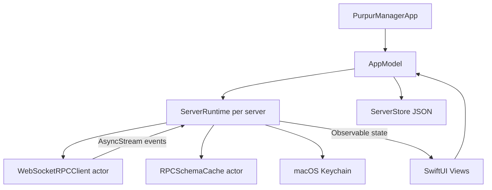

# Purpur Manager

A native, SwiftUI-first macOS management dashboard for the Purpur/Paper WebSocket JSON-RPC Management Server.

Built for modern macOS on Apple Silicon with Swift 6, Observation, async/await, Combine-friendly state boundaries, `URLSessionWebSocketTask`, Codable JSON-RPC models, Keychain-backed credentials, Charts, native notifications, and a translucent macOS design system.

## Status

This repository contains a complete Xcode macOS app project:

- `PurpurManager.xcodeproj`
- `PurpurManager/` SwiftUI application source
- `PurpurManager/Assets.xcassets` app icon + accent color
- `PurpurManager/Resources/Info.plist`

The project was validated locally with:

```bash
xcodebuild -project PurpurManager.xcodeproj -scheme PurpurManager -configuration Debug build
xcodebuild -project PurpurManager.xcodeproj -scheme PurpurManager -configuration Release build
```

Both builds succeeded with Xcode 26.5 / Swift 6.3.2 on arm64 macOS.

## Quick Start

1. Open `PurpurManager.xcodeproj` in Xcode.
2. Select the `PurpurManager` scheme.
3. Build and run on **My Mac**.
4. Add a server:
   - Host: e.g. `127.0.0.1`
   - Port: e.g. `7777`
   - TLS: off for `ws://`, on for `wss://`
   - API key: stored only in macOS Keychain
5. Connect. The app automatically calls `rpc.discover`, caches schemas, then refreshes status, players, gamerules, charts, and notifications.

## Implemented Features

### Connection Manager

- Server sidebar with grouped profiles
- Add/edit/remove server profiles
- Multiple simultaneous runtime sessions
- TLS toggle and endpoint preview
- API token stored in macOS Keychain
- Auto-connect and auto-reconnect settings
- Exponential reconnect backoff
- Ping display and health indicator
- Import/export server configs without secrets
- IP whitelist helper guidance
- Connection logs and frame inspector

### JSON-RPC / WebSocket Layer

- `URLSessionWebSocketTask` actor-based client
- Authorization header: `Authorization: Bearer <token>`
- JSON-RPC 2.0 request/response models
- Dynamic `JSONValue` for unknown schemas
- Raw frame sender
- Request timeout handling
- Pending continuation map by JSON-RPC id
- Graceful malformed packet recovery
- Notification routing
- WebSocket ping latency sampling
- `rpc.discover` bootstrap and schema cache

### Dashboard

- Modern translucent dashboard cards
- Server online/offline state
- TPS estimate
- Version/JVM/uptime
- Player count
- View distance / simulation distance
- Autosave status
- Memory, player, and latency charts via Charts framework
- Live activity feed

### Player Management

- Live player table
- Search/filter
- UUID copy
- Context menus
- Kick player
- Send message
- Operator management
- Allowlist management
- Ban action
- Batch quick actions

### Server Settings

- Live editable controls for:
  - `view-distance`
  - `simulation-distance`
  - `max-players`
  - `motd`
  - `difficulty`
  - `gamemode`
  - `autosave`
  - `allow-flight`
  - `player-idle-timeout`
  - `spawn-protection`
  - `hide-online-players`
  - `enforce-allowlist`
- Sliders, toggles, segmented pickers
- Change history
- Undo last setting change
- Reset-to-default RPC hooks

### Gamerule Editor

- Dynamic gamerule list
- Type detection: boolean, integer, string
- Search and categories
- Favorites
- Import/export JSON presets
- Direct `minecraft:gamerules/set` updates

### RPC Console

- Raw JSON-RPC editor
- JSON formatting
- Send raw frames
- Request history
- Saved snippets
- Dynamic schema explorer from `rpc.discover`
- Method documentation panel
- Frame responses visible in WebSocket inspector

### Notifications

- Native macOS notifications for:
  - Player joined
  - Player left
  - Server online
  - Connection lost
  - Autosave complete
  - High latency
- Per-server notification preferences

### Menu Bar Mode

- `MenuBarExtra` utility UI
- Server status and player count
- Quick reconnect
- Quick save/stop
- Quick broadcast message
- Open dashboard action

### Logs and System Messages

- Live log stream view from notification frames
- ANSI cleanup
- Severity coloring
- Search + regex filter
- Pause and export logs
- Broadcast composer for the required RPC format:

```json
{
  "jsonrpc": "2.0",
  "id": 1,
  "method": "minecraft:server/system_message",
  "params": {
    "overlay": false,
    "message": {
      "literal": "Hello"
    }
  }
}
```

## Architecture



### Key Files

- `PurpurManager/App/PurpurManagerApp.swift` — app entry, scenes, menu bar, commands
- `PurpurManager/ViewModels/AppModel.swift` — global server list and runtime coordination
- `PurpurManager/ViewModels/ServerRuntime.swift` — per-server state, RPC orchestration, reconnects
- `PurpurManager/Services/WebSocketRPCClient.swift` — actor-isolated WebSocket JSON-RPC implementation
- `PurpurManager/Services/KeychainStore.swift` — secure API token storage
- `PurpurManager/Models/JSONValue.swift` — dynamic JSON model for discovery and unknown methods
- `PurpurManager/Models/RPCModels.swift` — JSON-RPC request/response/error/frame models
- `PurpurManager/Views/*` — native SwiftUI dashboard, players, settings, gamerules, console, logs, inspector
- `PurpurManager/DesignSystem/VisualStyle.swift` — glass cards, gradients, visual modifiers

## RPC Method Strategy

Because the management API can evolve, `ServerRuntime` uses candidate method arrays and capability discovery:

1. Connect with bearer token.
2. Call `rpc.discover`.
3. Convert the response into `RPCMethodDescriptor` values.
4. Cache descriptors in Application Support.
5. Prefer discovered methods when performing actions.
6. Fall back to known Purpur/Paper method names when discovery is incomplete.
7. Treat unknown notifications as activity events instead of crashing.

## Security

- API keys are stored under a Keychain generic-password item keyed by server UUID.
- Exported server configs intentionally exclude tokens.
- Reconnect logic reads credentials from Keychain when needed.
- No WebView, Electron, or plaintext secret storage is used.

## Extensibility Notes

Prepared seams for future commercial-grade additions:

- Plugin system: add feature modules around `ServerRuntime.call(_:params:)` and `RPCMethodDescriptor`.
- Additional APIs: extend candidate method lists or add typed wrappers around dynamic JSON.
- External integrations: add services beside `NotificationService` for Discord, Home Assistant, Shortcuts, or AppleScript.
- Updater: `UpdaterService.swift` is Sparkle-ready without pulling Sparkle into the initial target.
- Widgets/AppIntents: state models are Sendable-friendly and can be mirrored into an app group later.
- Multi-window: `AppModel` can create per-window selected server/section state if desired.

## Build Commands

```bash
# Debug
xcodebuild -project PurpurManager.xcodeproj -scheme PurpurManager -configuration Debug build

# Release
xcodebuild -project PurpurManager.xcodeproj -scheme PurpurManager -configuration Release build
```

## Notes for Real Server Integration

The app is intentionally defensive because JSON-RPC discovery payloads can vary by server build. If your server exposes slightly different method names, the fastest integration path is to update the candidate arrays in `ServerRuntime` or rely on `rpc.discover` descriptors once the server reports them.
